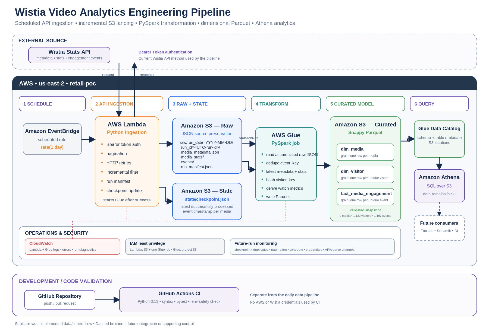
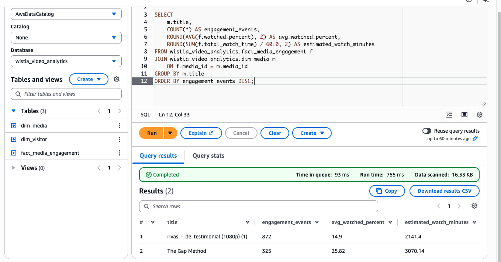
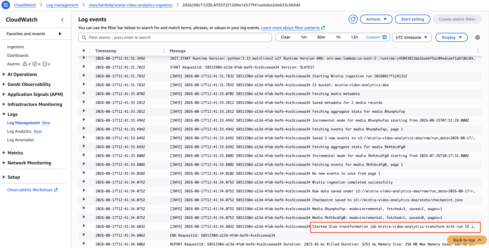
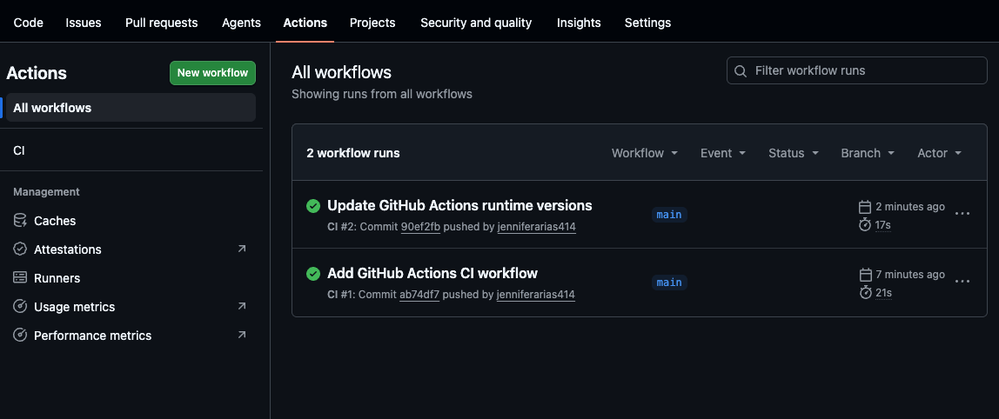
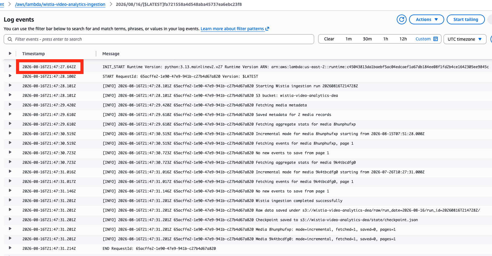

# Wistia Video Analytics Pipeline

An AWS data engineering pipeline that incrementally collects Wistia video analytics, preserves raw API responses, transforms engagement data with PySpark, and exposes a structured dimensional model for SQL analysis with Amazon Athena.

The pipeline combines scheduled API ingestion, persistent checkpointing, raw and curated S3 storage, AWS Glue transformation, dimensional modeling, automated code validation, and operational logging.



## Architecture

The implemented daily data path is:

```text
Amazon EventBridge
        ↓
AWS Lambda / Python
        ↓
Wistia Stats API
        ↓
S3 raw JSON + checkpoint
        ↓
Lambda starts AWS Glue
        ↓
Glue / PySpark
        ↓
S3 curated Parquet
        ↓
Glue Data Catalog
        ↓
Amazon Athena
```

GitHub Actions runs separately to validate repository changes:

```text
GitHub push / pull request
        ↓
Python syntax checks
        ↓
pytest
        ↓
tracked .env safety check
```

For the detailed architecture, service choices, data flow, IAM design, failure behavior, and operational considerations, see:

**[Architecture Overview](architecture/architecture-overview.md)**

---

## What the Pipeline Does

### Scheduled Wistia Ingestion

Amazon EventBridge invokes the ingestion Lambda on a daily schedule.

The Python ingestion:

- authenticates to the Wistia API
- retrieves media metadata and media statistics
- retrieves visitor-level engagement events
- processes paginated event results
- retries temporary HTTP failures
- applies incremental timestamp filtering
- writes raw API responses to S3
- writes a run manifest
- updates the persisted checkpoint after successful ingestion
- starts the Glue transformation job

Production ingestion code:

```text
src/ingestion/wistia_ingest.py
```

---

### Incremental Processing

Processing state is stored in:

```text
s3://wistia-video-analytics-dea/state/checkpoint.json
```

The checkpoint records the latest successfully processed event timestamp for each configured media item.

Conceptually:

```text
previous checkpoint
        ↓
retrieve current Wistia events
        ↓
compare received_at timestamps
        ↓
store only newer events
        ↓
successful ingestion
        ↓
advance checkpoint
```

This prevents the pipeline from blindly storing previously processed events on every run.

---

### Raw Data Preservation

Wistia API responses are preserved as JSON under run-specific S3 paths:

```text
raw/
└── run_date=YYYY-MM-DD/
    └── run_id=<UTC-run-id>/
        ├── media_metadata.json
        ├── media_stats/
        ├── events/
        └── run_manifest.json
```

The raw layer provides source traceability and allows the curated model to be rebuilt from accumulated source history.

---

### PySpark Transformation

After successful ingestion, Lambda starts:

```text
wistia-video-analytics-transform
```

The AWS Glue PySpark job:

- reads accumulated raw JSON
- deduplicates engagement events by `event_key`
- selects the latest media metadata and statistics
- hashes the source visitor key
- derives engagement metrics
- builds media, visitor, and engagement datasets
- writes Snappy-compressed Parquet to S3

Transformation code:

```text
src/transformation/transform_wistia.py
```

---

## Structured Data Model

Curated data is stored under:

```text
s3://wistia-video-analytics-dea/curated/
```

The final model contains three datasets:

| Table | Grain | Validated Snapshot |
|---|---|---:|
| `dim_media` | One row per configured media item | 2 |
| `dim_visitor` | One row per unique visitor | 1,122 |
| `fact_media_engagement` | One row per unique engagement event | 1,197 |

The row counts above are a **point-in-time validation snapshot**, not permanent table sizes.

`dim_media` remains at two while the pipeline is configured for the two supplied media IDs. Visitor and engagement counts can grow as new Wistia activity is ingested.

### Relationships

```text
fact_media_engagement.media_id
        ↓
dim_media.media_id
```

```text
fact_media_engagement.visitor_id
        ↓
dim_visitor.visitor_id
```

The raw Wistia `visitor_key` is SHA-256 hashed before becoming the curated `visitor_id`.

---

## Glue Data Catalog and Athena

The curated Parquet datasets are registered in the Glue Data Catalog database:

```text
wistia_video_analytics
```

Catalog tables:

```text
dim_media
dim_visitor
fact_media_engagement
```

Amazon Athena uses these catalog definitions to query the Parquet files stored in S3.

The actual analytical data remains in S3; the Glue Data Catalog stores table and schema metadata.

Table definitions:

**[sql/athena_setup.sql](sql/athena_setup.sql)**

Validation and analytics queries:

**[sql/validation_queries.sql](sql/validation_queries.sql)**

SQL notes:

**[sql/README.md](sql/README.md)**

---

## Data Quality Findings

### Duplicate Engagement Events

The initial full ingestion returned:

```text
1,199 raw event rows
```

Source validation found:

```text
1,197 distinct event_key values
2 duplicate event rows
0 missing event_key values
```

The PySpark transformation deduplicates on `event_key`, producing:

```text
1,197 unique engagement facts
```

The difference between raw and curated event counts is intentional deduplication rather than unexplained record loss.

### `percent_viewed` Scale

Source inspection showed that Wistia represents `percent_viewed` as a decimal from `0.0` to `1.0`.

For example:

```text
0.75 = 75% watched
```

The transformation therefore calculates:

```text
watched_percent =
percent_viewed × 100
```

and:

```text
total_watch_time =
duration_seconds × percent_viewed
```

Inspecting the source values before finalizing the transformation prevented an incorrect percentage/watch-time calculation.

---

## Validated Analytics

A sample Athena query compares engagement volume, viewing depth, and estimated watch time by media title.

At the time of validation:

| Media | Engagement Events | Avg. Watched | Estimated Watch Minutes |
|---|---:|---:|---:|
| `rivas_-_de_testimonial (1080p) (1)` | 872 | 14.90% | 2,141.40 |
| `The Gap Method` | 325 | 25.82% | 3,070.14 |

Although `The Gap Method` had fewer engagement events, it had a higher average watched percentage and accumulated more estimated watch time.

This demonstrates why engagement volume alone does not fully describe viewing behavior.



---

## Automation and Validation

The data-processing path was validated through:

```text
local ingestion
        ↓
manual AWS Lambda execution
        ↓
EventBridge scheduled invocation
        ↓
daily EventBridge configuration
        ↓
Lambda-triggered Glue transformation
        ↓
successful Glue completion
```

The EventBridge rule was temporarily configured at `rate(5 minutes)` to confirm automatic Lambda invocation and then changed to its final daily cadence.

Lambda-to-Glue automation was also validated by capturing the Glue `JobRunId` returned after Lambda called `StartJobRun` and confirming that the automatically initiated Glue run succeeded.



---

## GitHub Actions CI

The repository includes:

```text
.github/workflows/ci.yml
```

The workflow runs on:

```text
push to main
pull request
```

and performs:

- Python 3.13 setup
- runtime dependency installation
- development/test dependency installation
- Python syntax validation
- pytest unit tests
- tracked `.env` safety check

The CI workflow does not require AWS credentials or the Wistia API token.



---

## Operational Monitoring

Amazon CloudWatch captures Lambda execution details including:

- full vs. incremental processing mode
- events fetched
- events saved
- pages processed
- raw S3 output
- checkpoint updates
- Glue `JobRunId`
- exceptions and failures

AWS Glue maintains separate transformation run status and execution diagnostics.



Successful automation at one point in time does not guarantee permanent error-free execution. Ongoing operation should monitor for conditions such as checkpoint errors, duplicate ingestion, pagination issues, schedule configuration problems, credential failures, source/API changes, transient API errors, and unexpected historical reprocessing.

---

## Authentication and Security

The supplied project requirement described token-based Basic Authentication. The current Wistia API documentation identifies **Bearer Token** as the supported API authentication method, so the implemented integration uses:

```text
Authorization: Bearer <token>
```

Wistia documentation:

https://docs.wistia.com/docs/making-api-requests

The API token is supplied at runtime and is never stored in source control.

Additional protections include:

- `.env` files excluded from Git
- CI check for accidentally tracked environment files
- source `visitor_key` hashed before becoming curated `visitor_id`
- visitor name and email excluded from the curated model
- visitor-level source data excluded from public screenshots
- Lambda IAM access restricted to required S3 operations and one Glue job
- separate Glue execution role for transformation access

---

## Repository Structure

```text
.
├── .github/
│   └── workflows/
│       └── ci.yml
│
├── analysis/
│   └── API/source exploration scripts
│
├── architecture/
│   ├── architecture-overview.md
│   ├── wistia-video-analytics-architecture.png
│   └── wistia-video-analytics-architecture.svg
│
├── aws/
│   ├── iam/
│   ├── README.md
│   └── setup-reference.sh
│
├── screenshots/
│   └── selected validation evidence
│
├── sql/
│   ├── README.md
│   ├── athena_setup.sql
│   └── validation_queries.sql
│
├── src/
│   ├── ingestion/
│   │   └── wistia_ingest.py
│   └── transformation/
│       └── transform_wistia.py
│
├── tests/
│   └── test_ingestion.py
│
├── requirements.txt
├── requirements-dev.txt
├── RUN_INSTRUCTIONS.md
└── README.md
```

Private learning/build notes are intentionally excluded from Git.

---

## Run Instructions

Detailed setup, execution, validation, and troubleshooting instructions are available here:

**[RUN_INSTRUCTIONS.md](RUN_INSTRUCTIONS.md)**

The instructions cover:

- Python environment setup
- dependency installation
- credential handling
- local ingestion
- Lambda invocation
- EventBridge verification
- Glue execution
- S3 validation
- Glue Data Catalog validation
- Athena queries
- GitHub Actions
- troubleshooting

---

## AWS Resource Reference

AWS IAM policies, resource relationships, and rebuild commands are documented under:

**[aws/README.md](aws/README.md)**

The repository also contains:

```text
aws/setup-reference.sh
```

as a rebuild reference for the AWS environment.

The reference script does not store the Wistia credential.

---

## Technology

| Area | Technology |
|---|---|
| Source | Wistia Stats API |
| API ingestion | Python, `requests` |
| AWS SDK | Boto3 |
| Scheduling | Amazon EventBridge |
| Serverless compute | AWS Lambda |
| Raw/state storage | Amazon S3 |
| Transformation | AWS Glue, PySpark |
| Curated format | Snappy Parquet |
| Metadata catalog | AWS Glue Data Catalog |
| SQL analytics | Amazon Athena |
| Monitoring | Amazon CloudWatch |
| Access control | AWS IAM |
| Unit testing | pytest |
| CI | GitHub Actions |

---

## Key Project Files

| File | Purpose |
|---|---|
| `src/ingestion/wistia_ingest.py` | Production API ingestion and Lambda handler |
| `src/transformation/transform_wistia.py` | Glue/PySpark dimensional transformation |
| `tests/test_ingestion.py` | Unit tests for ingestion behavior |
| `.github/workflows/ci.yml` | GitHub Actions CI |
| `sql/athena_setup.sql` | Athena/Glue Catalog table definitions |
| `sql/validation_queries.sql` | Data validation and analytics SQL |
| `architecture/architecture-overview.md` | Detailed architecture and design decisions |
| `RUN_INSTRUCTIONS.md` | Setup, run, validation, and troubleshooting instructions |
| `aws/README.md` | AWS resources, IAM, and deployment reference |

---

## References

- [Wistia — Making API Requests](https://docs.wistia.com/docs/making-api-requests)
- [AWS Glue — StartJobRun](https://docs.aws.amazon.com/boto3/latest/reference/services/glue/client/start_job_run.html)
- [Amazon Athena — AWS Glue Data Catalog](https://docs.aws.amazon.com/athena/latest/ug/data-sources-glue.html)
- [Amazon Athena — Parquet](https://docs.aws.amazon.com/athena/latest/ug/parquet-serde.html)
